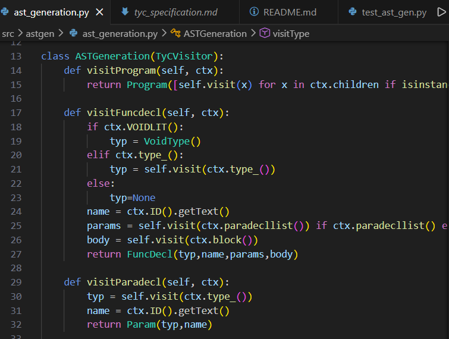

# TyC Language Compiler (Development Showcase)

> **⚠️ Academic Integrity Note:** The source code for this project is currently **private** to comply with the academic integrity policies of **Ho Chi Minh City University of Technology (HCMUT)**. It will be made public following final evaluation. 
> 
> *For recruiters: I am happy to provide a live demo or a code walkthrough during an interview.*

---

## 📋 Project Origin & Specification
This project is built based on the **TyC Language Specification**, a subset of C designed for formal compiler construction.
* **Base Specification:** [TyC Compiler Project Template](https://github.com/tnbduy/tyc-compiler)
* **Objective:** To implement a robust frontend that translates TyC source code into a verified Abstract Syntax Tree (AST), ensuring strict compliance with formal grammar.

---

## 🚀 Project Status
I have successfully completed the **Frontend** of the compiler. The project is designed to eventually evolve into a full end-to-end compiler.

### ✅ Phase 1: Completed (Frontend)
* **Lexical Analysis:** Tokenization of TyC source code with full support for literals, keywords, and operators.
* **Syntax Analysis:** Construction of concrete parse trees using **ANTLR4**.
* **AST Generation:** Implementation of the **Visitor Pattern** to produce a verified, decoupled Abstract Syntax Tree.

### ⏳ Phase 2: In Progress (Full Pipeline)
* **Semantic Analysis:** Implementing type checking, scope validation, and variable declaration verification.
* **Intermediate Representation (IR):** Generating a linear IR to bridge high-level code and machine instructions.
* **Code Generation:** Targeting **MIPS Assembly** to produce executable binaries.

---

## 🛠 Architecture & Design
The compiler follows a modular architecture to ensure clean code and easy maintainability.

### 1. Frontend (ANTLR4)
Processes `.tyc` source files based on custom-defined grammar rules.

### 2. Visitor Layer (Architectural Core)
I utilized the **Visitor Design Pattern** to transform verbose parse trees into optimized ASTs. Key principles applied:
* **Decoupling of Concerns:** AST nodes (e.g., `BinaryOp`, `IfStmt`) act as lightweight data containers, while the `ASTGeneration` class holds the traversal logic.
* **Open/Closed Principle:** New features (like Type Checking or MIPS Generation) can be added as new Visitor classes without modifying existing node structures.
* **Selective Data Extraction:** The logic "boils down" the complex ANTLR tree into only the data necessary for the compiler’s middle-end.

### 3. AST Nodes
Composed of custom Python classes organized into a hierarchy that supports recursive processing and future optimization.

---

## 🧪 Testing & Validation
To ensure the reliability of the frontend, I developed a comprehensive testing suite using the **pytest** framework.

* **Coverage:** **200+ Automated Unit Tests** rigorously verifying the Lexical Analyzer and AST Generation modules.
* **Edge Case Handling:** Verified "Maximal Munch" logic (e.g., `+++` as `++` and `+`), scientific notation (e.g., `.14E-5`), and complex string escape sequences.
* **Error Detection:** Tested custom error messages for unclosed strings and illegal characters to ensure a professional developer experience.
### Test Case Example

```python
#LEXER
def test_expression_maximal_munch_plus():
    """Ensures '+++' is correctly tokenized as '++' and '+' (Maximal Munch)"""
    tokenizer = Tokenizer("+++")
    assert tokenizer.get_tokens_as_string() == "++,+,<EOF>"

def test_literal_float_scientific_standard():
    """Verifies standard scientific notation handling"""
    tokenizer = Tokenizer("8.05e85")
    assert tokenizer.get_tokens_as_string() == "8.05e85,<EOF>"
#PARSER
def test_switch_double_default():
    """Error: Enforces that only one 'default' label is allowed"""
    source = "void main() { switch(x) { default: break; default: break; } }"
    assert Parser(source).parse() == "Error on line 1 col 42: default"
#AST
def test_nested_struct_ast():
    """Verifies AST structure for nested struct declarations"""
    source = """
    struct Pixel { int red; int green; };
    struct Frame { Pixel p1; };
    """
    expected = "Program([StructDecl(Pixel, [MemberDecl(IntType(), red), MemberDecl(IntType(), green)]), StructDecl(Frame, [MemberDecl(StructType(Pixel), p1)])])"
    assert str(ASTGenerator(source).generate()) == expected
```
---

## 🖼 Proof of Work



